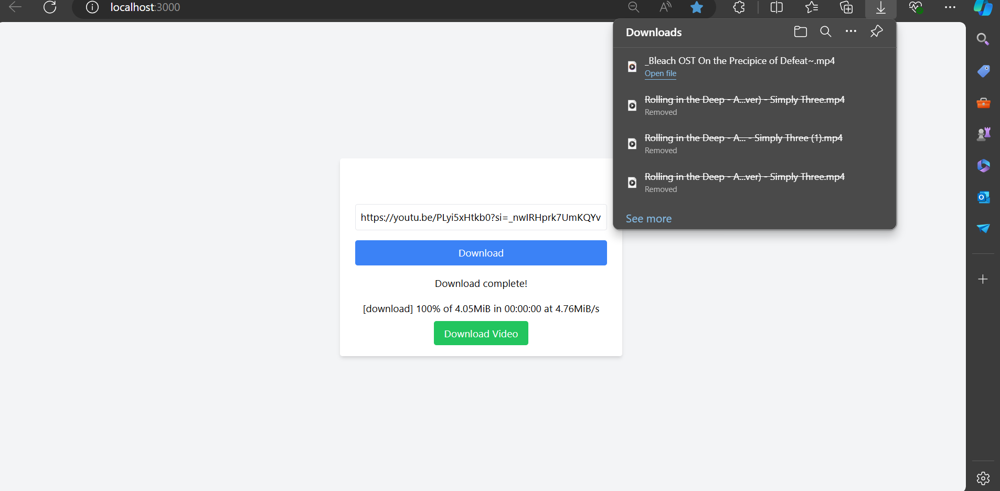

# Download your Favourite  YT Video

## How to Use the Python CLI Tool:-
 
 
   1. Navigate to the Directory
    
    
    cd Python-CLI-Tool
    pip install yt-dip
    python main .py
Use ctrl+shift+v to paste the URL in the CLI 

## Python CLI Tool Working

<b>The Videos are stored in the Downloaded_Video after the succesfull completion of the 

## How to Use NextJS Applictation:-

   1. Navigate to the Directory
    
    
    cd NextJS
    cd youtube-video-downloader
    npm install 
    npm run dev
It is not deployed in the Vercel or any other Platform Because of YouTube copyrights issues

## NextJS Applictation Working:-

<b> The Home Page:-

<b> The DownLoad Progress:-

<b> DownLoad Completed:-

<b> After Clicking on "Download Video" we can see the Video is stored in Download directory of our Comp by Default

<b> Note:- The video are also stored locally in our Nextjs project the downloaded videos are in the public directory in the folder downloads

